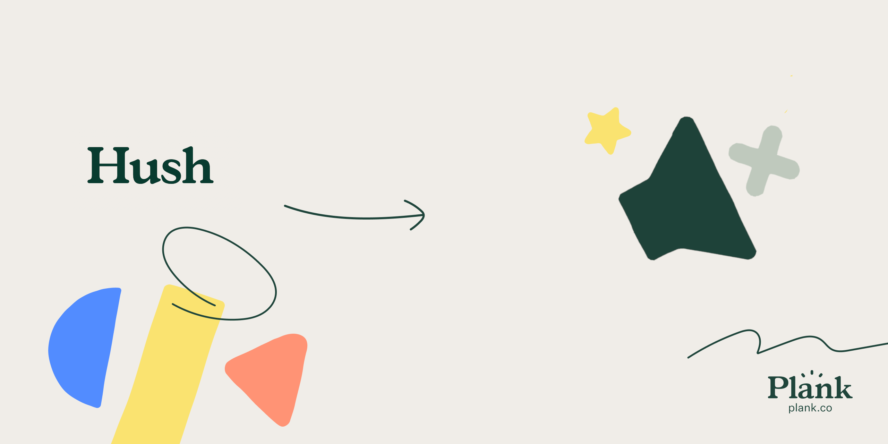

<p align="center"><a href="https://plank.co"></a></p>

<p align="center">
<a href="https://packagist.org/packages/plank/laravel-hush"></a>
<a href="https://github.com/plank/laravel-hush/actions?query=workflow%3Arun-tests"></a>
<a href="https://codeclimate.com/github/plank/laravel-hush/test_coverage"></a>
<a href="https://codeclimate.com/github/plank/laravel-hush/maintainability"></a>
</p>

# Laravel Hush

laravel-hush is a Laravel package that allows you to disable the observers and handlers for model events during the execution of a passed in closure. It functions as a more targetted version of the `withoutEvents()` method that ships with Laravel.

## Table of Contents

- [Installation](#installation)
- [Usage](#usage)
    - [withoutObserver(string $observer, Closure $callback)](#withoutobserverstring-observer-closure-callback)
    - [withoutObservers(array $observers, Closure $callback)](#withoutobserversarray-observers-closure-callback)
    - [withoutHandler(string $event, Closure $callback, array $classes)](#withouthandlerstring-event-closure-callback-array-classes)
    - [withoutHandlers(array $events, Closure $callback, array $classes)](#withouthandlersarray-events-closure-callback-array-classes)
- [Credits](#credits)
- [License](#license)
- [Security Vulnerabilities](#security-vulnerabilities)

&nbsp;

## Installation

You can install the package via composer:

```bash
composer require plank/laravel-hush
```

&nbsp;

## Usage

The package ships with one trait: `HushesHandlers`

To enable the functionality on a model, simply include the trait on it.

It implements four methods:

### withoutObserver(string $observer, Closure $callback)

This method will disable any handlers in the provided class for all of the models observable events during the exection of the callback.

Example assuming `User` uses `HushesHandlers`. In this example no handlers from the entire `UserObserver` class will be called during the execution of the callback, for any observable event.

```php
User::withoutObserver(UserObserver::class, function () {
    User::create(['name' => 'John Doe']);
});
```

### withoutObservers(array $observers, Closure $callback)

This method is the same as `withoutObserver()` but allows you to pass in an array of observer classes to disable.

For example:

```php
User::withoutObservers([UserObserver::class, ExpirableObserver::class], function () {
    User::create(['name' => 'John Doe']);
});
```

### withoutHandler(string $event, Closure $callback, array $classes)

This method will disable handlers for the provided event during the execution of the callback.

When no classes are provided, it will disable all handlers for the event.

When classes are provided (including classes where handlers have been added statically) it will only disable the registered handlers which are from the provided classes.

In the following example all `created` event handlers would be disabled, however if there were `creating` handlers registered for example, those event handlers would still run.

```php
User::withoutHandler('created', function () {
    User::create(['name' => 'John Doe']);
});
```

In the following example all `created` event handlers defined in the `User` model would be disabled, however if there was a `created` handler in a `UserObserver` class (or anywhere else), it would still handle the event.

```php
User::withoutHandler('created', function () {
    User::create(['name' => 'John Doe']);
}, [User::class]);
```

### withoutHandlers(array $events, Closure $callback, array $classes)

This method is the same as `withoutHandler()` but allows you to pass in an array of events to disable handlers for.

&nbsp;

## Credits

- [Kurt Friars](https://github.com/kfriars)
- [All Contributors](../../contributors)

&nbsp;

## License

The MIT License (MIT). Please see [License File](LICENSE.md) for more information.

&nbsp;

## Security Vulnerabilities

If you discover a security vulnerability within siren, please send an e-mail to [security@plankdesign.com](mailto:security@plankdesign.com). All security vulnerabilities will be promptly addressed.
